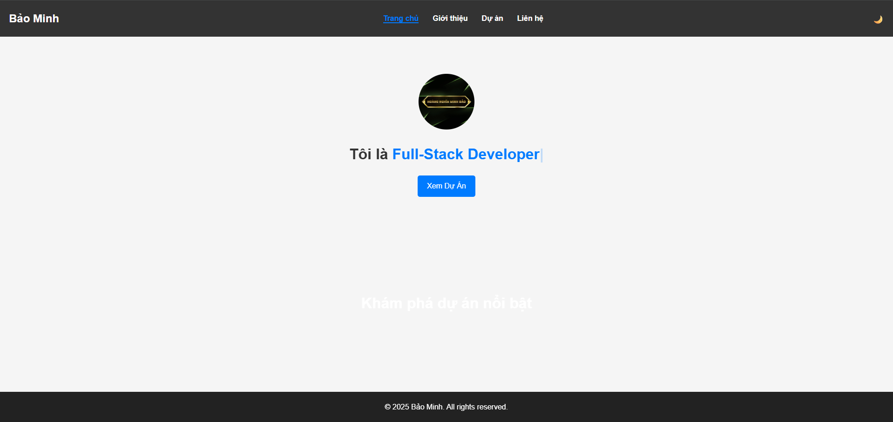
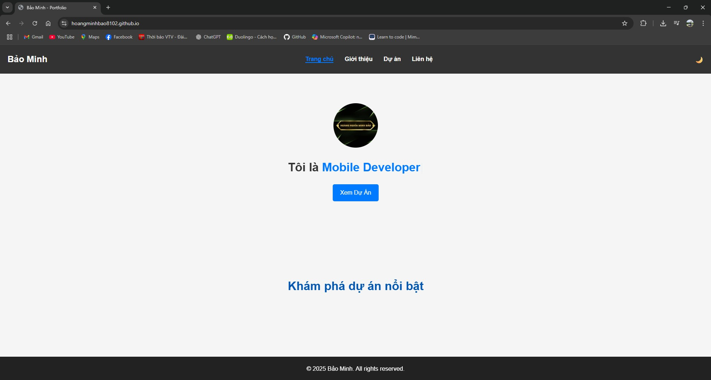
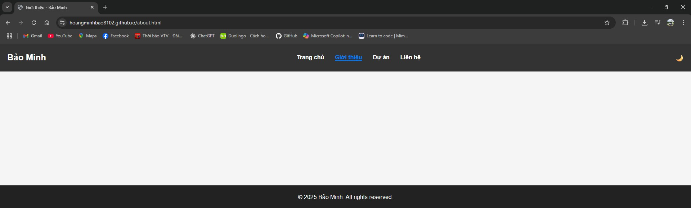

# 🌐 Bảo Minh - Portfolio Website



> Website Portfolio cá nhân của **Bảo Minh** – Full-Stack Developer, Mobile Developer.

---

## ✨ Giới thiệu

Đây là website cá nhân được xây dựng nhằm:

- Giới thiệu bản thân, kỹ năng và kinh nghiệm lập trình.
- Trưng bày các dự án nổi bật đã thực hiện.
- Cung cấp cách liên hệ và hồ sơ cá nhân.

Website hỗ trợ **Dark Mode**, **Menu Mobile**, **Parallax Background**, **Typing Animation** và **Scroll Reveal mượt** như template premium.

---

## 🚀 Công nghệ sử dụng

- **HTML5, CSS3, JavaScript (Vanilla)**
- **Typed.js** (Typing Text Animation)
- **ScrollReveal.js** (Scroll Reveal)
- **Responsive Design (Mobile-First)**
- **GitHub Pages** (Hosting miễn phí)

---

## 📂 Cấu trúc thư mục

hoangminhbao8102.github.io/<br>
│── index.html<br>
│── about.html<br>
│── portfolio.html<br>
│── contact.html<br>
│── assets/<br>
│ ├── css/style.css<br>
│ ├── js/main.js<br>
│ └── img/<br>
│ ├── avatar.jpg<br>
│ ├── project1.jpg<br>
│ ├── project2.jpg<br>
│ └── project3.jpg<br>
│── README.md<br>

---

## 🖥️ Demo

- **Live Website:** [https://hoangminhbao8102.github.io](https://hoangminhbao8102.github.io)

Ảnh minh họa:

  


---

## ⚡ Tính năng nổi bật

- **Dark Mode**: Giao diện tối giúp trải nghiệm ban đêm dễ chịu.
- **Typing Text**: Chữ chạy kiểu gõ máy tại Hero Section.
- **Parallax**: Hình nền di chuyển mượt tạo cảm giác chiều sâu.
- **Scroll Reveal**: Phần tử xuất hiện mượt khi cuộn trang.
- **Responsive**: Hỗ trợ mọi màn hình, từ mobile đến desktop.
- **Menu Mobile**: Hamburger menu trượt mượt.

---

## 📦 Cách chạy dự án

### 1. Clone repository
```bash
git clone https://github.com/hoangminhbao8102/hoangminhbao8102.github.io
cd hoangminhbao8102.github.io
```

### 2. Chạy trực tiếp

Mở index.html bằng trình duyệt (không cần server).

### 3. Deploy lên GitHub Pages
Commit & Push code lên branch main.

Vào Settings > Pages > Source: main branch.

Truy cập link: https://<username>.github.io.

# 🤝 Đóng góp
Bạn có ý tưởng cải thiện? Hãy fork repo và gửi pull request.

# 🧑‍💻 Tác giả
Bảo Minh – GitHub

# 📜 Giấy phép
Dự án này sử dụng giấy phép MIT License.
